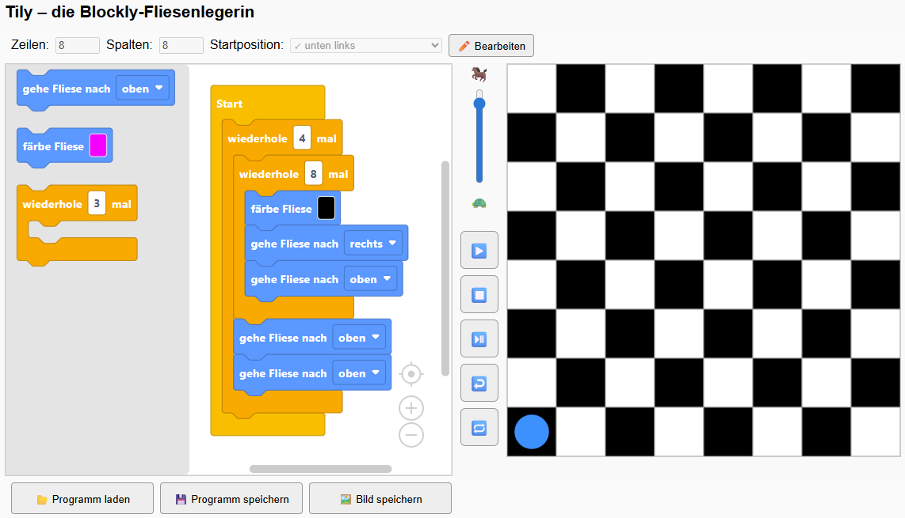

# 🟥 Tily - Die blockbasierte Fliesenlegerin

Lege Fliesen mithilfe der blockbasierten Programmierung. Nutzer:innen können über Blöcke einen Roboter steuern, der Fliesen legt und so Pixelbilder zeichnen.

## 🔍 Funktionen

- Blockly-Editor mit Blöcken zum Bewegen und einem Schleifenblock zum Steuern des Roboters
- Schrittweiser oder vollständiger Programmlauf mit Hervorhebung des aktuellen Blocks
- Einstellen der Ablaufgeschwindigkeit
- Speichern/Laden des Programmcodes als XML

## 🖼️ Screenshot



## 🚀 Online ausprobieren

> Wird unterstützt durch **GitHub Pages**.

👉 [Hier klicken, um das Projekt direkt im Browser zu starten](https://tonitaste.github.io/Tily/)

## 📦 Installation (lokal)

Du kannst das Projekt lokal starten, indem du die Dateien einfach in einen Ordner speicherst und `index.html` in einem Browser öffnest:

```bash
git clone https://github.com/ToniTaste/Tily.git
cd Tily
# Dann: index.html im Browser öffnen
